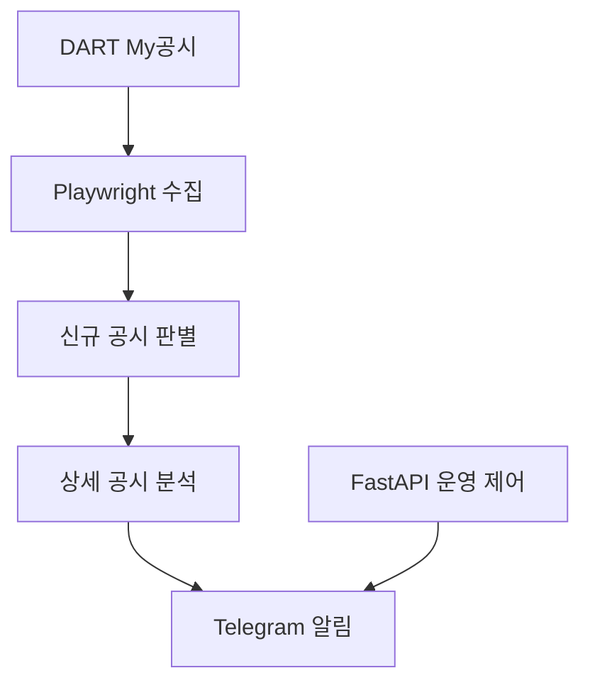

# DisclosureEdge

DisclosureEdge는 DART 전자공시에서 자기주식 관련 공시를 빠르게 감지하고 Telegram으로 전달하는 공시 모니터링 시스템입니다.

공시 수집, 신규 공시 판별, 상세 내용 분석, 알림 전송을 하나의 애플리케이션에서 처리하되 각 기능을 독립된 모듈로 분리한 **모듈러 모놀리스** 구조로 개발했습니다.

## 프로젝트 배경

자기주식 취득 공시는 기업의 주가와 투자 판단에 영향을 줄 수 있지만, 사용자가 DART를 계속 확인하기는 어렵습니다. DisclosureEdge는 관심 공시를 주기적으로 확인하고 새 공시가 등록되면 필요한 내용을 자동으로 분석하여 빠르게 전달하는 것을 목표로 합니다.

## 주요 기능

| 기능           | 설명                                                                                |
| -------------- | ----------------------------------------------------------------------------------- |
| DART 모니터링  | Playwright로 DART My공시 페이지를 주기적으로 확인합니다.                            |
| 신규 공시 감지 | DART 접수번호를 기준으로 이미 확인한 공시와 새 공시를 구분합니다.                   |
| 공시 분석      | 목록에서 기업명과 보고서 정보를 수집하고 상세 페이지의 주요 내용을 파싱합니다.      |
| 알림 전송      | 분석한 자기주식 공시를 Telegram으로 전달합니다.                                     |
| 운영 제어      | FastAPI를 통해 모니터와 알림 기능의 상태를 확인하고 실행 중 알림 전송을 제어합니다. |

## 동작 흐름



1. 애플리케이션이 DART My공시 페이지를 주기적으로 조회합니다.
2. 수집한 접수번호와 이전에 확인한 접수번호를 비교합니다.
3. 새 공시 중 지원 대상에 해당하는 보고서만 선별합니다.
4. 공시 상세 페이지를 열어 알림에 필요한 내용을 추출합니다.
5. 정리된 공시 정보를 Telegram으로 전송합니다.

## 시스템 구성

```text
app/
  main.py
  disclosure/
    browser.py
    monitor.py
    parser.py
    service.py
  notification/
    publisher.py
    telegram.py
test/
  test_disclosure.py
```

- **disclosure**: DART 접속, 공시 수집, 신규 공시 판별, 상세 내용 분석을 담당합니다.
- **notification**: 공시 처리 로직과 외부 알림 채널을 분리하고 Telegram 전송을 담당합니다.
- **main**: 애플리케이션 생명주기와 운영 API를 관리합니다.
- **test**: 알림·필터 단위 테스트와 실제 DART 연동 스모크 테스트를 포함합니다.

## 기술 스택

- Python 3.13
- FastAPI
- Playwright
- asyncio
- Telegram Bot API

## 설계 방향

### 모듈러 모놀리스

초기 단계에서 배포와 운영 복잡도를 낮추기 위해 하나의 애플리케이션으로 구성했습니다. 대신 공시 도메인과 알림 기능을 모듈 단위로 분리하여 이후 저장소, 주문, 추가 알림 채널을 독립적으로 확장할 수 있도록 설계했습니다.

### 알림 포트 분리

공시 서비스가 Telegram 구현에 직접 의존하지 않도록 알림 인터페이스를 분리했습니다. 이를 통해 향후 Slack 등 다른 채널을 추가하더라도 공시 처리 로직의 변경을 최소화할 수 있습니다.

### 비동기 처리

DART 페이지 조회와 Telegram 전송처럼 대기 시간이 발생하는 외부 연동을 비동기로 처리하여 모니터링 흐름이 불필요하게 차단되지 않도록 구성했습니다.

## 실행 및 테스트

애플리케이션은 FastAPI와 Uvicorn으로 실행합니다.

```powershell
python -m uvicorn app.main:app --host 127.0.0.1 --port 8000
```

단위 테스트와 실제 DART 연동 스모크 테스트를 분리하여 사용합니다.

```powershell
python -m unittest test.test_notification -v
python -m test.test_disclosure
```

실제 인증 정보와 환경별 설정은 Git에서 제외된 로컬 환경 파일로 관리합니다. 저장소에는 값이 비어 있는 설정 예시만 포함합니다.

## 현재 한계와 개선 계획

초기버전으로 다음 기능으로 확장할 계획입니다.

- SQLite 또는 관계형 데이터베이스를 이용한 공시 처리 이력 저장
- 실패한 공시 분석 및 알림 전송 재시도
- 운영 이력과 장애 확인 기능
- 키움증권 모의투자 주문 연동
- Telegram을 이용한 서비스 상태 조회 및 실행 제어

## 보안

- 실제 봇 토큰과 채팅 정보는 저장소에 포함하지 않습니다.
- 비밀 정보는 실행 환경에서 주입합니다.
- 로컬 브라우저 프로필과 환경 설정 파일은 Git 추적 대상에서 제외합니다.
