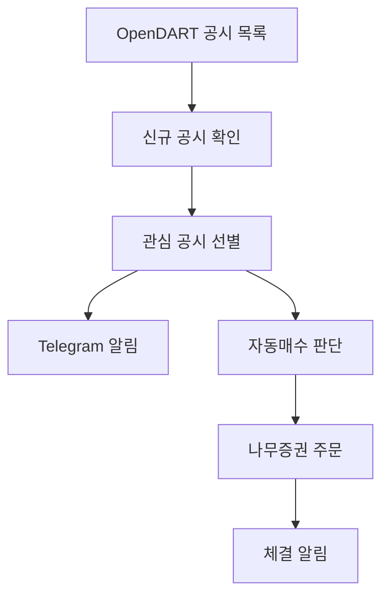

# DisclosureEdge

DisclosureEdge는 DART 전자공시에서 사용자가 지정한 관심 공시를 빠르게 감지하고, Telegram 알림과 자동매수 흐름으로 연결하는 공시 모니터링 서비스입니다.

공시 수집, 신규 공시 판별, 알림 전송, 매수 시도, 체결 알림을 하나의 서비스 흐름에서 처리합니다. 사용자가 DART를 직접 반복 확인하지 않아도 중요한 공시 접수 여부를 빠르게 파악하고, 필요한 경우 즉시 매수까지 이어질 수 있도록 설계되었습니다.

## 프로젝트 배경

특정 공시는 기업의 주가와 투자 판단에 빠르게 영향을 줄 수 있지만, 사용자가 DART를 계속 확인하며 대응하기는 어렵습니다. DisclosureEdge는 관심 공시를 주기적으로 확인하고, 새 공시가 등록되면 알림과 자동매수 판단까지 이어지는 자동화된 대응 흐름을 제공하는 것을 목표로 합니다.

특히 공시가 접수된 직후의 대응 속도가 중요한 상황을 고려해, 상세 공시 내용을 오래 파싱하기보다 목록에서 확인 가능한 핵심 정보와 사전에 설정된 공시 유형을 기준으로 빠르게 판단합니다.

## 주요 기능

| 기능           | 설명                                                                    |
| -------------- | ----------------------------------------------------------------------- |
| DART 모니터링  | OpenDART 목록을 주기적으로 조회해 관심 공시 접수 여부를 확인합니다.     |
| 신규 공시 감지 | 접수번호를 기준으로 이미 확인한 공시와 새 공시를 구분합니다.            |
| 관심 공시 선별 | 사전에 지정된 보고서 유형에 해당하는 공시만 알림과 매수 판단으로 넘깁니다. |
| Telegram 알림  | 감지된 관심 공시와 자동매수 결과, 체결 내역을 Telegram으로 전달합니다.  |
| 자동매수 연동  | 자동매수가 활성화된 상태에서 조건을 만족하면 나무증권 주문 흐름으로 연결합니다. |
| 리스크 제한    | 중복 주문, 일일 매수 한도, 주문 예산, 최소 현금 잔고 등을 확인합니다.   |
| 운영 제어      | Telegram 명령으로 자동매수를 중지하거나 다시 시작하고 상태를 확인합니다. |
| 장애 알림      | 공시 조회, 공시 처리, 체결 수신 과정의 장애를 Telegram으로 전달합니다.  |

## 동작 흐름

1. 서비스가 DART 공시 목록을 주기적으로 조회합니다.
2. 접수번호를 기준으로 새로 등록된 공시만 구분합니다.
3. 관심 공시에 해당하면 Telegram으로 공시 알림을 전송합니다.
4. 자동매수가 켜져 있으면 계좌 상태와 리스크 제한 조건을 확인합니다.
5. 조건을 만족하면 주문을 시도하고, 체결 내역을 다시 Telegram으로 전달합니다.

## 시스템 구성

DisclosureEdge는 하나의 애플리케이션 안에서 공시 감시, 주문 판단, 알림, 운영 제어를 역할별 서비스로 나누어 동작합니다.

| 영역        | 역할 |
| ----------- | ---- |
| 공시 서비스 | DART 공시 목록을 조회하고 새 공시를 판별합니다. |
| 매수 서비스 | 관심 공시에 대해 자동매수 가능 여부를 판단하고 주문 흐름으로 연결합니다. |
| 알림 서비스 | 공시 감지, 주문 결과, 체결 내역, 장애 상황을 Telegram으로 전달합니다. |
| 운영 서비스 | Telegram 명령과 상태 조회를 통해 자동매수 동작을 제어합니다. |

서비스 프로세스는 항시 실행되는 것을 기준으로 합니다. 다만 DART 공시 조회는 정해진 시간에만 수행되며, 그 외 시간에는 공시 polling만 쉬고 운영 명령, 상태 확인, 알림 처리 같은 서비스 기능은 계속 동작합니다.

## 설계 방향

### 서비스 분리

공시 감시와 자동매수는 서로 다른 책임으로 분리했습니다. DART 조회는 새 공시를 빠르게 감지하는 역할에 집중하고, 매수 서비스는 계좌 상태와 리스크 제한을 확인한 뒤 주문 여부를 결정합니다.

이 구조에서는 Telegram `stop` 명령으로 자동매수만 멈출 수 있습니다. 공시 모니터링과 운영 상태 확인은 유지되므로, 필요할 때 `start` 명령으로 다시 매수 동작을 켤 수 있습니다.

### 빠른 판단

공시 접수 직후의 대응 속도를 우선하기 위해 상세 공시 페이지 파싱에 의존하지 않습니다. 목록에서 확인 가능한 보고서 유형과 종목 정보를 기준으로 관심 공시를 선별하고, 불필요한 외부 요청을 줄여 매수 판단까지의 시간을 줄입니다.

### 운영 안정성

자동매수는 빠르게 실행되더라도 기본적인 제한 장치를 거칩니다. 이미 주문한 공시나 당일 매수한 종목은 다시 주문하지 않고, 일일 한도와 주문 예산, 최소 현금 잔고를 확인해 과도한 주문을 막습니다.

## 운영 관점

DisclosureEdge는 항상 자동매수를 실행하는 서비스가 아니라, 공시 감지와 매수 실행을 분리해 운영할 수 있도록 설계되었습니다. 공시 모니터링은 계속 유지하면서도 Telegram 명령으로 자동매수만 중지하거나 다시 시작할 수 있습니다.

자동매수는 빠른 대응을 목표로 하지만, 실거래에서는 예기치 않은 주문 실패, 체결 지연, API 장애, 시장 변동성이 발생할 수 있습니다. 따라서 실거래 적용 전에는 충분한 모의투자와 제한 금액 테스트가 필요합니다.
